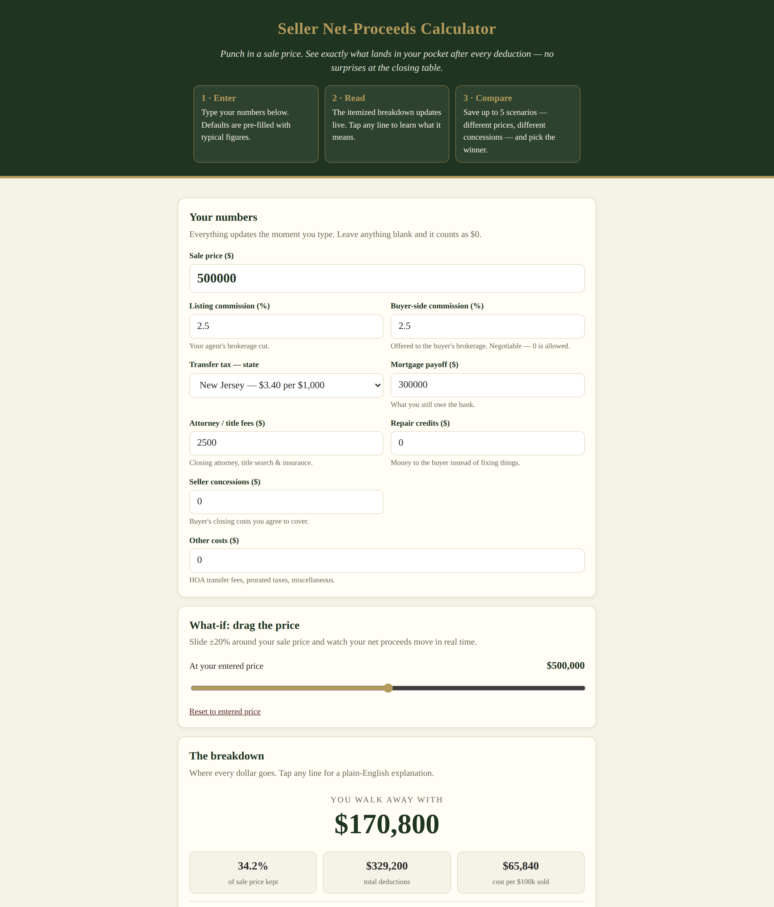

# Seller Net-Proceeds Calculator

**Live app:** https://thebullbrew.github.io/seller-net-proceeds/

Punch in a sale price and see exactly what lands in your pocket after every deduction — no surprises at the closing table.

- **Your numbers** — sale price, listing and buyer-side commissions, transfer tax (NJ/PA/NY/FL/CA/TX presets plus custom), mortgage payoff, attorney/title fees, repair credits, seller concessions, other costs.
- **What-if slider** — drag the price ±20% and watch your net proceeds move in real time.
- **The breakdown** — itemized deductions with tap-to-expand plain-English explainers, big bold net number, % of price kept, and cost per $100k sold.
- **Save & compare** — keep up to 5 scenarios side by side, with the best net flagged automatically.

Built for the kitchen table: clear title, a 3-step "how to use it" strip, and every section labeled in plain words.

## Run it

No build step. Open `docs/index.html` in a browser, or visit the live link above. It's a PWA — Add to Home Screen on iPhone for the full app feel. Works offline after first load; saved scenarios stay in the browser via localStorage.

## The math

| Line | How it's figured |
|---|---|
| Listing commission | Sale price × your % |
| Buyer-side commission | Sale price × your % (0% allowed — it's negotiable) |
| Transfer tax | Sale price × state rate, or your custom $/% |
| Mortgage payoff | Flat balance you enter — lender gets paid first |
| Attorney / title, repair credits, concessions, other | Flat amounts you enter |
| Net proceeds | Sale price − all of the above |

Planning estimates, not legal or tax advice. Transfer taxes vary by county and municipality — verify your local rate before you sign anything.

## Deploy your own

Static files under `docs/` — publish with any static host (this repo uses GitHub Pages).

---

*Part of the daily finance & real-estate tool series. One useful tool, every day.*
